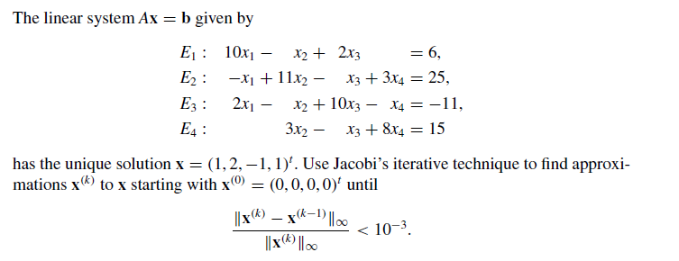

Numerical Method self-study -- Jacobi and Gauss-Seidel:
======================

Example problem:
-------------

Reference:
-------------
Numerical Analysis -- Richard L. Burden, J. Douglas Faires -- 9th Edition